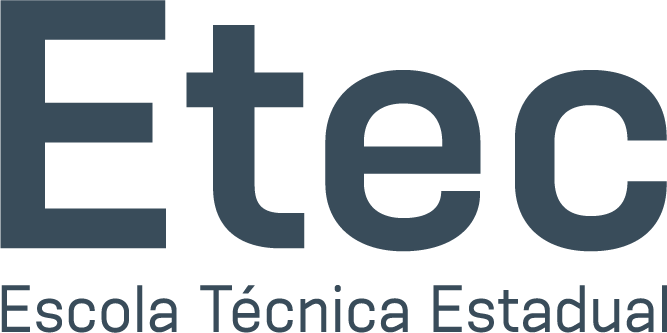

# ETEC 2024

Esse é um repositório para todos os estudos do curso técnico de Desenvolvimento de Sistemas da ETEC Cidade Tiradentes no ano de 2024. Nele, eu estou no 2° ano de curso.

---
## Matérias
Atualmente tenho 4 matérias, sendo estas:
- Desenvolvimento de Sistemas
- Programação de Aplicativos Mobile
- Programação Web
- Banco de Dados
